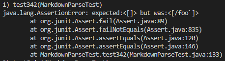
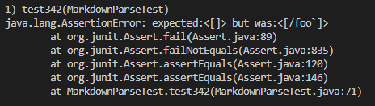
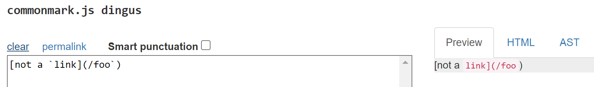
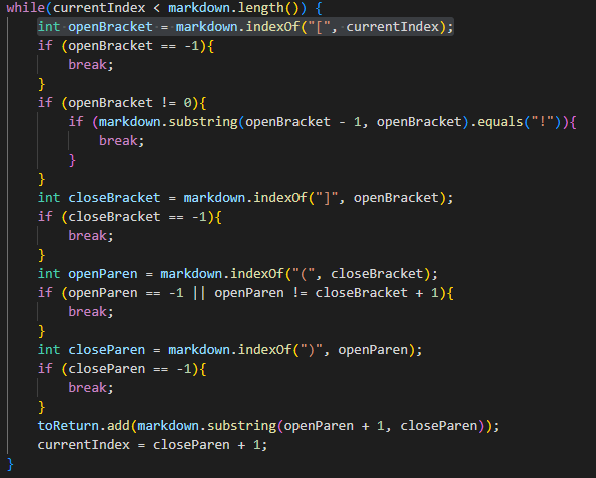
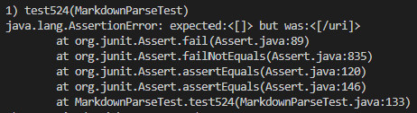
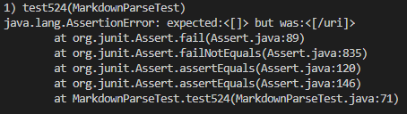
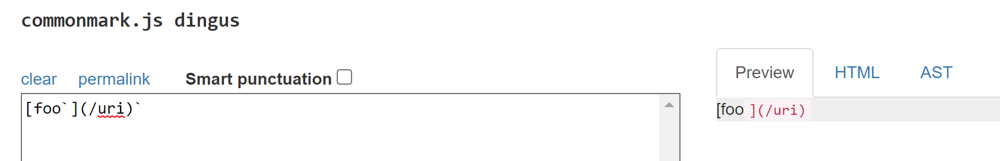
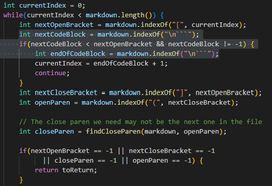

# Week 10 Lab Report

## Link to Test Files

I was able to find the tests with different results by manually searching the files in VS Code and seeing the different outputs produced with the JUnit tests. It was a slow approach but I was able to discover the following two files:

[Test File 342](https://github.com/nidhidhamnani/markdown-parser/blob/main/test-files/342.md)

[Test File 524](https://github.com/nidhidhamnani/markdown-parser/blob/main/test-files/524.md)

## Test File 342

Neither of our implementaions are correct because they both have a link in the array when there shouldn't be any.

Expected Output is: []

*Possible Bug Fix*

The code snippet above is a view of what I have for my implementation of the parser. I highlighted one of the areas of concern as it is good to check for the brackets but I never accounted for the possible backticks that show up both inside and outside of the link structure. A possible fix for this bug that could be implemented is to check for backticks inside of the brackets and parentheses using the indexOf function so that whenever a minimum of two show up anywhere in the file it will be recognized as a code block rather than any other regular character. One backtick wouldn't be a problem as markdown will only produce the specified code block if another back tick follows it anywhere after the first.

## Test File 524

Both of our implementations were wrong because both produce a link in the array list when in reality there shouldn't be any.

Expected Output is: []

*Possible Bug Fix*

This is a view of the markdown parser we were given in the week 9 lab and highlighted is the segment where I think improvements can be made. The same problem encountered by my implementation occurs with theirs as we fail to account for backticks in the possible files. A possible way of fixing this is by checking for backticks in between brackets. I think it was handled well with how they used the if statement and indexOf for code blocks so I think the same can be done with backticks. This example only takes into account it being inside brackets so it would also need to be done for parentheses as well.