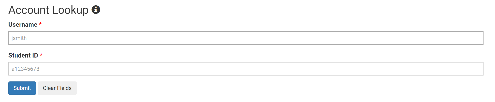

# Week 2 Lab Report

**This website will be dedicated to helping you log into a course-specific account on the *ieng6* server.**

Here I will outline the specific steps needed in order to continue this process and a bit of extra information to help out once you log in!

## 1. Installing VS Code

In order to start this whole process we first need to install [VS Code](https://code.visualstudio.com/) onto our device.

You should be greeted with a page similar to this one and simply follow the directions for installation. 


Once the installation has been completed, open VS Code.


If a page like the one above shows up you are good to continue to the following steps.

## 2. Remotely Connecting

If you are working on a Windows computer, installing [OpenSSH](https://docs.microsoft.com/en-us/windows-server/administration/openssh/openssh_install_firstuse) is necessary in order to connect your computer to other computers. Click the hyperlink and proceed with the instructions. 

We are required to also use our course-specific account for CSE15L so click the following link to access it: [Account Lookup](https://sdacs.ucsd.edu/~icc/index.php)



Enter your username and ID and you should be greeted with a page similar to this one:


The account name located at the bottom of the previous screenshot is the account you will be utilizing everytime you log in to the remote computer. The 3 letters at the end of your account are unique to you so amke sure to remember them as they will be used next. 

Click the account and you will need to change the global password in order for this process to fully work.

Once we have all this information navigate to back to VS Code and open a new terminal. This can be done by clicking on the menu item titled *Terminal* and then clicking *New Terminal* or simply using the keyboard shortcut *Ctrl + `*.

In the terminal you will type the following line and replace zz with the 3 letters of your own account: 
```
ssh cs15lsp22zz@ieng6.ucsd.edu
```

Click enter and a long message will pop up and at the end it will ask if you are sure you want to continue connecting. Type out *yes* and click enter. 

If done properly you will be asked to type in a password. It is worth noting that if you were to type anything in this space you will not be able to see what is being typed in the terminal. **This is okay.** The terminal has this feature for security purposes so just type out the password you used when you changed your global password. 


You are now remotely connected to a computer located in the CSE basement!

## 3. Trying Some Commands

The following are some of the various commands we have available to us and their specific uses: 

- `cd` - changes directory
- `ls` - lists files
- `pwd` - prints the working dorectory
- `mkdir` - makes/creates a new directory
- `cp` - copies files/directories
- `cat` - prints the contents of a file

Some of these commands need to be accompanied with more text so be weary when trying to use each one. 

For example: 


The image above shows me trying out some of the commands on the server and we can see that when I first tried `cd` it did nothing but once I later tried `cd new` the terminal took me to the directory call *new*. I later tried `cd ~` and it took me back to the main directory.

It is important to note that in order to logout of the remote server from the terminal we can either use: 

- Ctrl + D
- Run the `exit` command


## 4. Moving Files With `scp`

In this step we will be learning how to copy files back and forth from our own computers to the remote computers.

For the purpose of this demonstration copy the following code and create a new file titled `WhereAmI.java`. 

```
class WhereAmI {
  public static void main(String[] args) {
    System.out.println(System.getProperty("os.name"));
    System.out.println(System.getProperty("user.name"));
    System.out.println(System.getProperty("user.home"));
    System.out.println(System.getProperty("user.dir"));
  }
}
```

Paste it inside and open your terminal. Then run the following command: 

`scp WhereAmI.java cs15lsp22zz@ieng6.ucsd.edu:~/`

The terminal will ask you for your password again. Type it in and proceed to using the `ssh` command once again. Use the `ls` command this time and notice that the `WhereIAm.java` file is now present in our directory on the remote computer. Run javac and java on the file and also notice that it will print the contents of the server.


## 5. Setting An SSH Key

This is an important step that will make logging in an easier process from now on. We will utilize a command called ssh-keygen and it will essentially create a pair of files called the *public key* and *private key* which can be used in place of the password. A public key is set up on the server (remote computer) end and a private key is set up on the client (our computer) end. 

If your still connected to the server, log out and proceed on your own computer. Type the following command: 

`ssh-keygen`

or if your on Windows:

`ssh-keygen -t ed25519`

You will be prompted to "Enter Passphrase", just click enter and then click enter again. More text will appear and you will be greeted with an image similar to the following: 


Once this happens you know that the process went correctly and that the private key is in a file `id_rsa` and the public key is in a file `id_rsa.pub` under the `.ssh` directory on your computer.

All that's left to do now is copying the public key to the server/remote computer. 

To do this we will use the `scp` command again. Login to the server by using the `ssh` command and create a new directory titled ".ssh".

`mkdir .ssh`

Logout and use the following command on your computer to copy the public key the server. 

`scp /Users/<user-name>/.ssh/id_rsa.pub cs15lsp22zz@ieng6.ucsd.edu:~/.ssh/authorized_keys`

Replace "user-name" with your username and "zz" with your 3 letters from before and press enter.

If done correctly the next time you login to the server using `ssh` you won't need to enter a password.


## 6. Optimizing Remote Running

Some techniques you can use for the future include the following:

- Place in quotes the commands you want to run after trying to login to the server

`ssh cs15lsp22zz@ieng6.ucsd.edu "mkdir new"`

- Use semicolons to run multiple commands on the same line

`cp WhereAmI.java WhereIAmPart2.java; javac WhereIAmPart2.java; java WhereAmI`

- Use the up-arrow on your keyboard to call the previous command that was run in the terminal