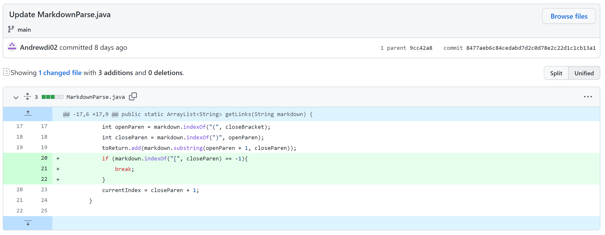
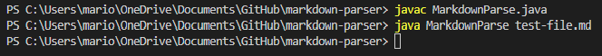
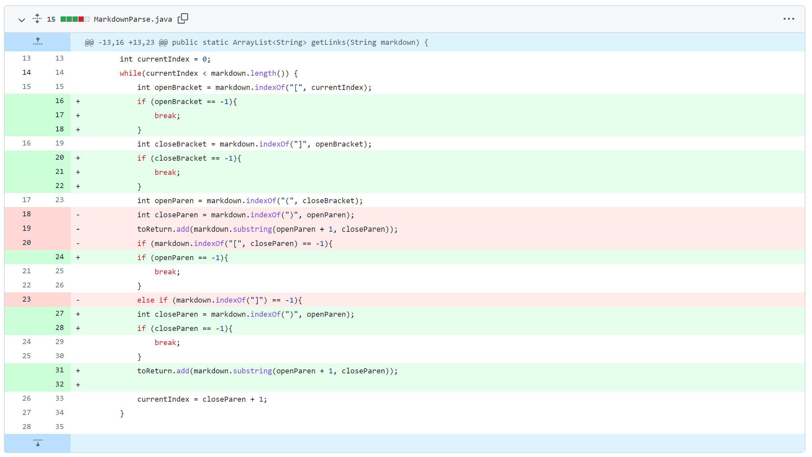
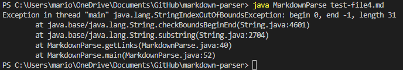
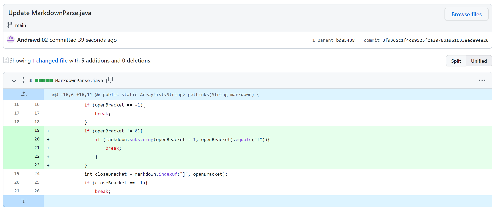
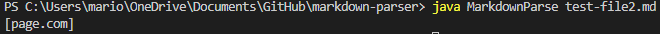

# Week 4 Lab Report

## First Code Change

[Test File](https://github.com/nidhidhamnani/markdown-parser/blob/main/test-file.md)

Linked above is the test file that I used to test my MardownParse code in which it can be seen with the image that when run in the terminal it was stuck in an infinite loop. We saw in the test file that there was an extra line added at the end so to ensure that our code would account for this small detail we decided to include an if statement at the start which would check if there were anymore open brackets in the test file. Since there weren't any after the initial link then the loop would break and return only the link that was present.

## Second Code Change

[Test File](https://github.com/nidhidhamnani/markdown-parser/blob/main/test-file3.md)

After testing a couple more files we ran into another problem with our code. Linked above is the test file we used and the resulting output in the terminal gave us an index out of bound error. We had trouble figuring this error out for a while but we realized that the program would try to find the open parenthesis and since there weren't any in the file then the line with ``indexOf`` would return -1. To fix this issue we decided to include if statments in the program that would check if the ``indexOf`` lines would return -1 and if they did, then the loop would break and return the correct elements.

## Third Code Change

[Test File](https://github.com/nidhidhamnani/markdown-parser/blob/main/test-file6.md)

The third change we made in our code was as a result of the test file linked above giving us an incorrect output. It can be seen that the terminal was returning an image link which is something that shouldn't happen as we are only supposed to return regular links. This is something we had to avoid and in order to do so we created an if statement at the start of our program that would check if the character before an open bracket was an exclamation point and if it was, then it would break and return from there.