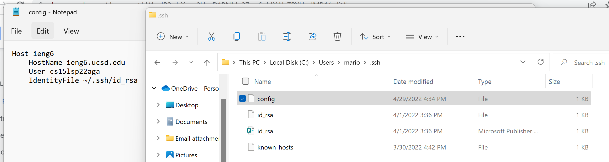
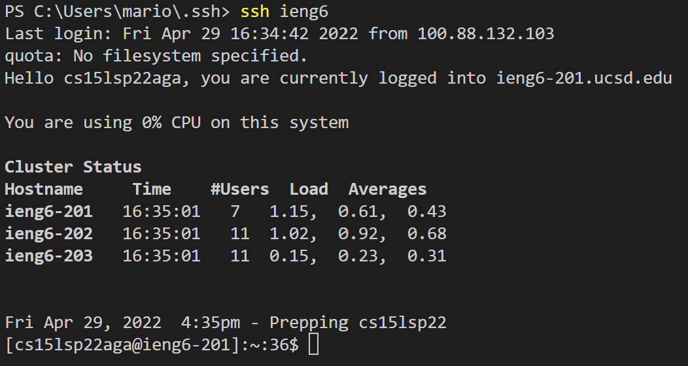
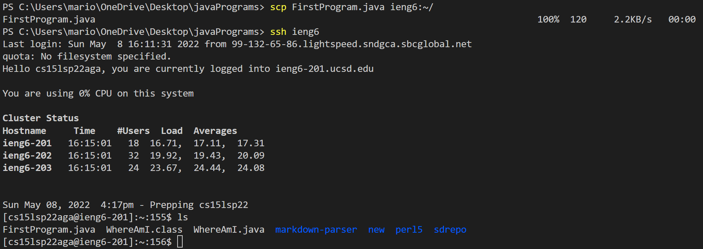

# Week 6 Lab Report

## Streamlining ssh Configuration

- Config file editied through Notepad

- `ssh` command with new alias

- Copying a file with `scp` using new alias

## Setup Github Access from ieng6

