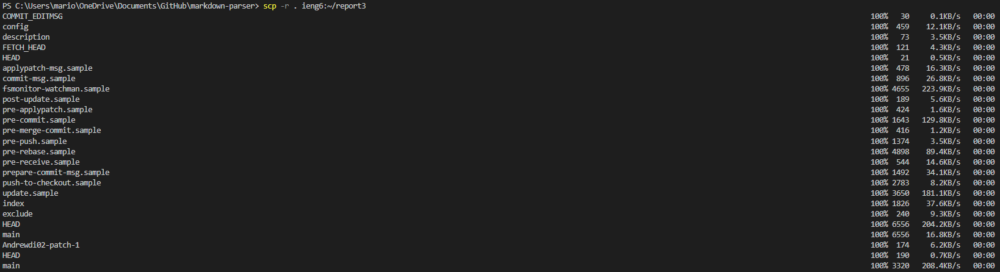

# Week 6 Lab Report

## Streamlining ssh Configuration

- Config file editied through Notepad

- `ssh` command with new alias

- Copying a file with `scp` using new alias

## Setup Github Access from ieng6

- Public key on Github

- Public and private key on user account

- Git commands for commiting and pushing a change to Github

[Link to the commit](https://github.com/Andrewdi02/sdrepo/commit/4b6c6f1be8acda443a7af8e616b8bd92e2012ccb)

## Copy Whole Directories with `scp -r`

- Copying whole markdown-parse directory to ieng6 account

- Running tests on ieng6 account

- Combination of all the commands on one line

