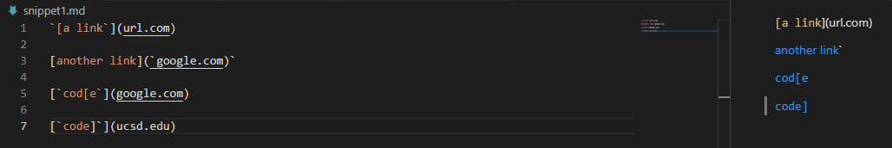

# Week 8 Lab Report

## Links to Repositories

[My Repo](https://github.com/Andrewdi02/markdown-parser)

[Other Group's Repo](https://github.com/richmass1/markdown-parser)

## Snippet 1

The corresponding list of links according to the VScode preview should be:
[`google.com, google.com, ucsd.edu]

My implementation failed for this test and looks like the following:

Other group's implementation failed for this test and looks like the following:

## Snippet 2

The corresponding list of links according to the VScode preview should be:
[a.com, a.com(()), example.com]

My implementation failed for this test and looks like the following:

Other group's implementation failed for this test and looks like the following:

## Snippet 3

The corresponding list of links according to the VScode preview should be:
[https://sites.google.com/eng.ucsd.edu/cse-15l-spring-2022/schedule]

My implementation failed for this test and looks like the following:

Other group's implementation failed for this test and looks like the following:

## Possible Changes

1. I think the code change for my program to account for the backticks inside these links will be realtively small. I have to first account for whether they show up before the open and closed brackets as then it would affect the counter I have in place for the indices. I need to make sure that any of the characters inside these backticks aren't closed brackets as well because then the link that follows won't register but besides that I feel the change won't be as involved as other possible tests.

2. I think the code change for my program to account for nested brackets, parentheses, and escaped brackets will be a larger task to accomplish. I have to change the way I check the index for my closed parenthesis as it is possible that a link might contain one inside of it as seen in the snippet. Another aspect I have to look out for is the escaped brackets. Not only will I have to check if there is a backslash that surrounds any of the possible brackets, but I will also have to check if there is a valid bracket after these escaped ones. 

3. I think the code change for my program to account for newlines in brackets and parentheses is a very involved task to accomplish and thus requires a larger changes in my code. The reason why I say this is because checking for the closed parenthesis without knowing the size of a link is fairly difficult so accounting for the possible edge cases will require a lot of if else statements in my code. Not only will I have to account for this but I would also need to check for any spaces after newlines as those don't properly register as links in markdown. 